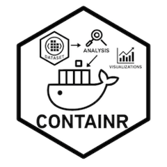

<!-- README.md is generated from README.Rmd. Please edit that file -->

```{r, include = FALSE}
knitr::opts_chunk$set(
  collapse = TRUE,
  comment = "#>",
  fig.path = "man/figures/README-",
  out.width = "100%"
)
```

# containr



<!-- badges: start -->
[](https://github.com/erwinlares/containr/actions/workflows/R-CMD-check.yaml)
[](https://doi.org/10.5281/zenodo.19462130)
[](https://CRAN.R-project.org/package=containr)
[](https://cran.r-project.org/package=containr)
<!-- badges: end -->

`containr` helps researchers containerize their R projects. Its core function,
`generate_dockerfile()`, analyzes a project's environment and dependencies via
`renv.lock` and generates a ready-to-use `Dockerfile` — so analyses can be
reliably shared, archived, and rerun across systems.

## Installation

You can install `containr` from CRAN:

```{r, eval = FALSE}
install.packages("containr")
```

Or install the development version from [GitHub](https://github.com/erwinlares/containr):

```{r, eval = FALSE}
# install.packages("pak")
pak::pak("erwinlares/containr")
```

## Usage

Below are common ways to use `generate_dockerfile()`:

```{r, eval = FALSE}
library(containr)

# Generate a Dockerfile with the latest R version and renv.lock dependencies
generate_dockerfile()

# Specify a particular R version
generate_dockerfile(r_version = "4.3.0")

# Use an RStudio Server image
generate_dockerfile(r_mode = "rstudio")

# Print progress messages during generation
generate_dockerfile(verbose = TRUE)

# Add explanatory comments to the generated Dockerfile
generate_dockerfile(comments = TRUE)
```

## Citation

To cite `containr` in publications:

```{r, eval = FALSE}
citation("containr")
```

## License

Apache License (>= 2) © Erwin Lares
