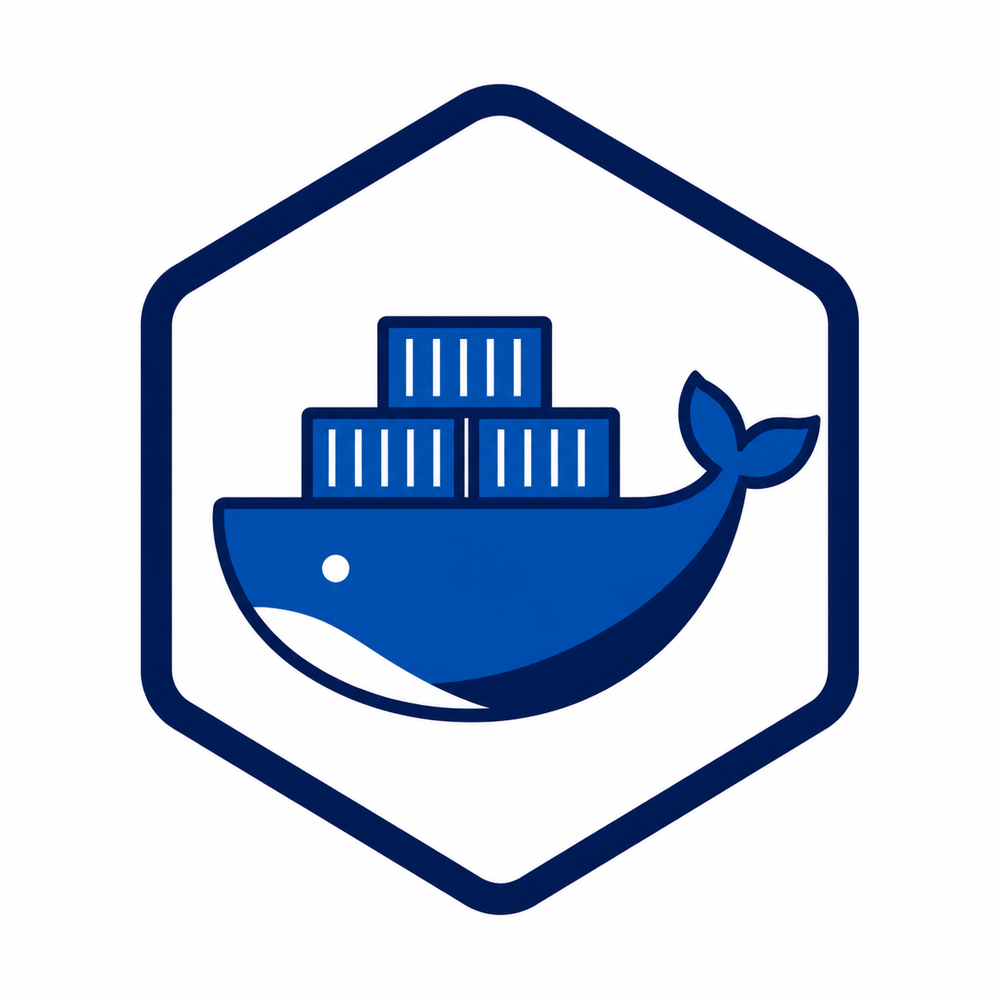

# containr 

<!-- badges: start -->
[](https://github.com/erwinlares/containr/actions/workflows/R-CMD-check.yaml)
[](https://CRAN.R-project.org/package=containr)
[](https://cran.r-project.org/package=containr)
[](https://doi.org/10.5281/zenodo.19462130)
[](https://erwinlares.r-universe.dev/containr)
[](https://lifecycle.r-lib.org/articles/stages.html#experimental)
[](https://app.codecov.io/gh/erwinlares/containr)
<!-- badges: end -->

## The problem with "it works on my machine"

An R analysis that runs cleanly on your laptop can fail on a collaborator's
computer, produce different results after a system update, or break when moved
to a computing cluster. The cause is often the same: the software environment
is only implicit. The R version, package versions, system libraries, and
command-line tools needed by the project are scattered across one machine
instead of recorded as part of the analysis.

That fragility becomes more expensive over time. A project may need to be
reviewed, rerun, shared with a collaborator, archived with a publication, or
scaled up on high-throughput computing infrastructure. If the environment is
not captured, reproducing the analysis becomes a reconstruction project.

Containers help solve this problem by packaging the analysis together with the
software environment it needs. A container image can run on your laptop, on a
collaborator's machine, on a cloud server, or on CHTC with the same core
software stack.

`containr` helps researchers containerize R projects from inside R. It reads
your `renv.lock` file, generates a `Dockerfile`, builds a container image, and
pushes that image to a registry. The goal is not to make every researcher a
container expert. The goal is to make a reliable, repeatable containerization
path available from the workflow researchers already use.

If you are new to containers, `containr` gives you a guided path through the
core steps. If you already use Docker or Podman, it reduces boilerplate and
helps standardize container generation across projects.

---

## When to use containr

Use `containr` when you are:

- preparing an R project that needs to run somewhere other than your laptop;
- sharing an analysis with collaborators who need the same software environment;
- archiving a computational workflow for reproducibility;
- preparing a project to run on CHTC or another HTCondor-based system;
- teaching researchers how `renv`, containers, and reproducible execution fit
  together;
- standardizing container creation across multiple R projects;
- moving from "this works on my machine" to "this environment is captured and
  portable."

`containr` is useful on its own. You do not need to submit jobs to CHTC to
benefit from a containerized R project. A container can support collaboration,
review, preservation, training, and reproducible reruns even when all work
stays local.

---

## The toolero family

`containr` is the second step in a three-package family for reproducible
research workflows, from local project setup to containerization and
high-throughput computing submission:

```text
toolero     organize, scaffold, split
  └─ containr   freeze the software environment in a container
       └─ submitr    send the analysis to CHTC and retrieve results
```

Each package is useful on its own. Together, they form a path from a new local
R project to a containerized analysis that can run on high-throughput computing
infrastructure.

You can adopt these packages one at a time. `containr` does not require
`toolero`, and it does not require `submitr`. If you used
`toolero::init_project()` to start your project, `renv` is already initialized
and `renv::snapshot()` will produce the lockfile that `containr` needs. If you
did not use `toolero`, run `renv::snapshot()` in your project root before
proceeding.

---

## Before you start

`containr` assumes your project already has enough structure to describe its R
package environment. Before using it, confirm that:

- your project uses `renv` and `renv.lock` exists in the project root;
- Podman or Docker is installed and running;
- you have access to a container registry if you plan to push the image.

At UW-Madison, `registry.doit.wisc.edu` is the default registry used by the
CHTC-oriented workflow.

---

## Installation

Install from CRAN:

```r
install.packages("containr")
```

For the latest development features, install from GitHub:

```r
# install.packages("pak")
pak::pak("erwinlares/containr")
```

---

## A first workflow

The core workflow has four steps: generate a `Dockerfile`, build the image,
inspect local images, and push the image to a registry. The first three steps
happen inside R. Authentication with the container registry happens once in the
terminal before you push.

```r
library(containr)

# 1. Generate a Dockerfile from renv.lock
generate_dockerfile(
  r_version = "4.4.0",
  data_file = "data-raw/sample.csv",
  code_file = "analysis.R",
  output    = ".",
  comments  = TRUE
)

# 2. Build the image locally
build_image(verbose = TRUE)

# 3. Inspect local images
imgs <- list_images()

# 4. Push the image to the registry
push_image(
  image_id = imgs$image_id[1],
  namespace = "your.netid",
  project  = "my-analysis",
  tag      = "1.0.0"
)
```

For a first pass, use `comments = TRUE` when generating the `Dockerfile` and
`dry_run = TRUE` before running commands that build or push. The annotations
and previews make the container workflow easier to inspect, teach, and debug.

---

## Core workflow functions

### `generate_dockerfile()`

`generate_dockerfile()` reads your `renv.lock`, identifies the R packages used
by the project, queries their system library requirements, and writes a
`Dockerfile`.

The generated `Dockerfile` is a plain text file. You can inspect it, edit it,
delete it, and regenerate it as many times as needed while refining your setup.
This makes `generate_dockerfile()` a low-risk entry point into
containerization: the first step is not building an image; it is making the
container recipe visible.

When you include files via `data_file`, `code_file`, or `misc_file`, the
generated `COPY` instructions preserve your local directory structure inside
the container under `/home/`. A file at `data-raw/sample.csv` locally ends up
at `/home/data-raw/sample.csv` in the container -- not flattened into
`/home/data/`. This means your R scripts can use the same relative paths
inside the container that they use on your machine. All files must be inside
the current working directory (the build context) -- files outside it will
produce an error, since Dockerfile `COPY` cannot reach beyond the build
context.

```r
# Generate a Dockerfile from the current project
generate_dockerfile(r_version = "4.4.0", output = ".")

# Include a data file -- preserves directory structure in the container
generate_dockerfile(
  r_version = "4.4.0",
  data_file = "data-raw/penguins.csv",
  code_file = "analysis.R",
  output    = "."
)

# Use an RStudio Server image instead of plain R
generate_dockerfile(
  r_version = "4.4.0",
  r_mode    = "rstudio",
  output    = "."
)

# Add extra system libraries not caught by auto-detection
generate_dockerfile(
  r_version       = "4.4.0",
  install_syslibs = c("libuv1-dev", "libwebp-dev"),
  output          = "."
)

# Guided generation with progress messages and annotated Dockerfile
generate_dockerfile(
  r_version = "4.4.0",
  output    = ".",
  verbose   = TRUE,
  comments  = TRUE
)
```

The `comments = TRUE` argument annotates each instruction in the generated
`Dockerfile` with an explanation of what it does. This is useful when you are
learning containerization, reviewing the file with collaborators, or teaching
why each layer exists.

---

### `build_image()`

`build_image()` passes your `Dockerfile` to Podman or Docker and builds the
image locally. The build context is the current working directory, so all file
paths in the `COPY` instructions are resolved relative to where you call
`build_image()` -- typically the project root.

The `platform` argument defaults to `"linux/amd64"`, which is the architecture
used by most HPC and HTC clusters. On Apple Silicon Macs, this means the build
targets a different architecture than the host. When Docker is the resolved
tool, `build_image()` automatically switches to `docker buildx build` with
`--load` for cross-platform builds. For Podman, `--platform` is passed
directly. Set `platform = NULL` to build for the host architecture instead.

If the target platform differs from the host, a warning is emitted about
potential QEMU emulation issues. Docker Desktop handles cross-platform builds
more reliably than Podman's QEMU layer. If builds fail with segfaults under
Podman, try `tool_preference = "docker"` or build on a native x86_64 machine.

The first build can take time because the container engine must download the
base image and install the R package environment from scratch. Later builds are
usually faster because Podman and Docker reuse cached layers when the earlier
parts of the `Dockerfile` have not changed.

```r
# Build for linux/amd64 (default) -- suitable for CHTC and most clusters
build_image(verbose = TRUE)

# Build and tag for the DoIT GitLab Container Registry
build_image(
  tag = "registry.doit.wisc.edu/your.netid/my-analysis:1.0.0"
)

# Build for the host architecture (e.g. local use on Apple Silicon)
build_image(platform = NULL)

# Build for ARM64 explicitly
build_image(platform = "linux/arm64")

# Preview the build command without running it
build_image(dry_run = TRUE)
```

Use `dry_run = TRUE` when you want to see the command before running it. This
is especially helpful in examples, tutorials, and package documentation because
it shows what would happen without requiring a live container engine.

---

### `list_images()`

`list_images()` returns a data frame of images in the local image store. It is
the R equivalent of checking which images are available with `podman image ls`
or `docker image ls`.

```r
imgs <- list_images()
#>                                      repository    tag      image_id      created     size
#> 1  registry.doit.wisc.edu/your.netid/my-analysis  1.0.0  974123909a36  2 hours ago  1.59 GB
#> 2                                        <none>  <none>  3b8f20dc1a47  3 hours ago  1.21 GB
```

Untagged images -- those built without a name -- appear with `<none>` in the
`repository` and `tag` columns. The `image_id` column contains the hash you
pass to `push_image()`.

---

### `push_image()`

`push_image()` tags a local image with a registry path and pushes it to a
container registry. Before pushing, authenticate with the registry once in a
terminal. `containr` checks whether you are logged in before attempting the
push and errors with instructions if not. The UW-Madison authentication guide,
including how to create a Personal Access Token with the right scopes, is here:

<https://git.doit.wisc.edu/ERWIN.LARES/container-registry>

```r
# Push to UW-Madison's DoIT GitLab Container Registry
push_image(
  image_id = imgs$image_id[1],
  namespace = "your.netid",
  project  = "my-analysis",
  tag      = "1.0.0"
)

# Preview the tag and push commands without running them
push_image(
  image_id = imgs$image_id[1],
  namespace = "your.netid",
  project  = "my-analysis",
  tag      = "1.0.0",
  dry_run  = TRUE
)
```

Use explicit version tags such as `"1.0.0"` rather than `"latest"`. The
`"latest"` tag is overwritten on every push, which makes it harder to
reconstruct which image was used for a specific result.

---

## What comes next

Once your image is in the registry, it can be referenced by any workflow that
knows how to run container images. For CHTC and other HTCondor-based systems,
that image URI becomes part of the submit file:

```
container_image = docker://registry.doit.wisc.edu/your.netid/my-analysis:1.0.0
```

The `submitr` package handles the next step in the CHTC-oriented workflow:
generating the HTCondor submit file, uploading files to the submit node,
submitting the job, monitoring progress, and retrieving results.

You can stop at `containr` if your goal is a portable, reviewable, shareable R
environment. You can continue to `submitr` when your goal is to run that
environment on CHTC.

---

## renv and containers

`renv` records the R package versions used by your project -- the right
starting point for reproducibility. A container goes one level lower, capturing
the operating-system-level environment needed to install and run those packages:
system libraries, command-line tools, and the base image that supplies the
runtime. `containr` connects these layers by using `renv.lock` as the source
for the generated `Dockerfile`.

In other words, `renv` and containers are not alternatives. They are
complementary layers of the same reproducibility stack. The vignette
[From renv to containers: why recording your R packages may not be
enough](https://erwinlares.github.io/containr/articles/why-containers.html)
covers this relationship in more depth, with concrete scenarios where `renv`
alone is not sufficient.

---

## Learn more

The package vignettes cover the full containerization workflow and the
conceptual relationship between `renv` and containers:

- [From renv to containers: why recording your R packages may not be
  enough](https://erwinlares.github.io/containr/articles/why-containers.html)
  -- the case for containers as a complement to `renv`, with concrete scenarios
  where `renv` alone is not sufficient.

- [A first containerization workflow with
  containr](https://erwinlares.github.io/containr/articles/containr-workflow.html)
  -- a step-by-step walkthrough of `generate_dockerfile()`, `build_image()`,
  `list_images()`, and `push_image()`, with annotated output at each step.

---

## Related packages

`containr` is part of a family of packages for reproducible research workflows:

- [toolero](https://github.com/erwinlares/toolero) -- organize and scaffold
  research projects
- **containr** -- containerize the project (this package)
- [submitr](https://github.com/erwinlares/submitr) -- submit containerized R
  jobs to CHTC and retrieve results

---

## Citation

```r
citation("containr")
```

## License

Apache License (>= 2) (c) Erwin Lares
