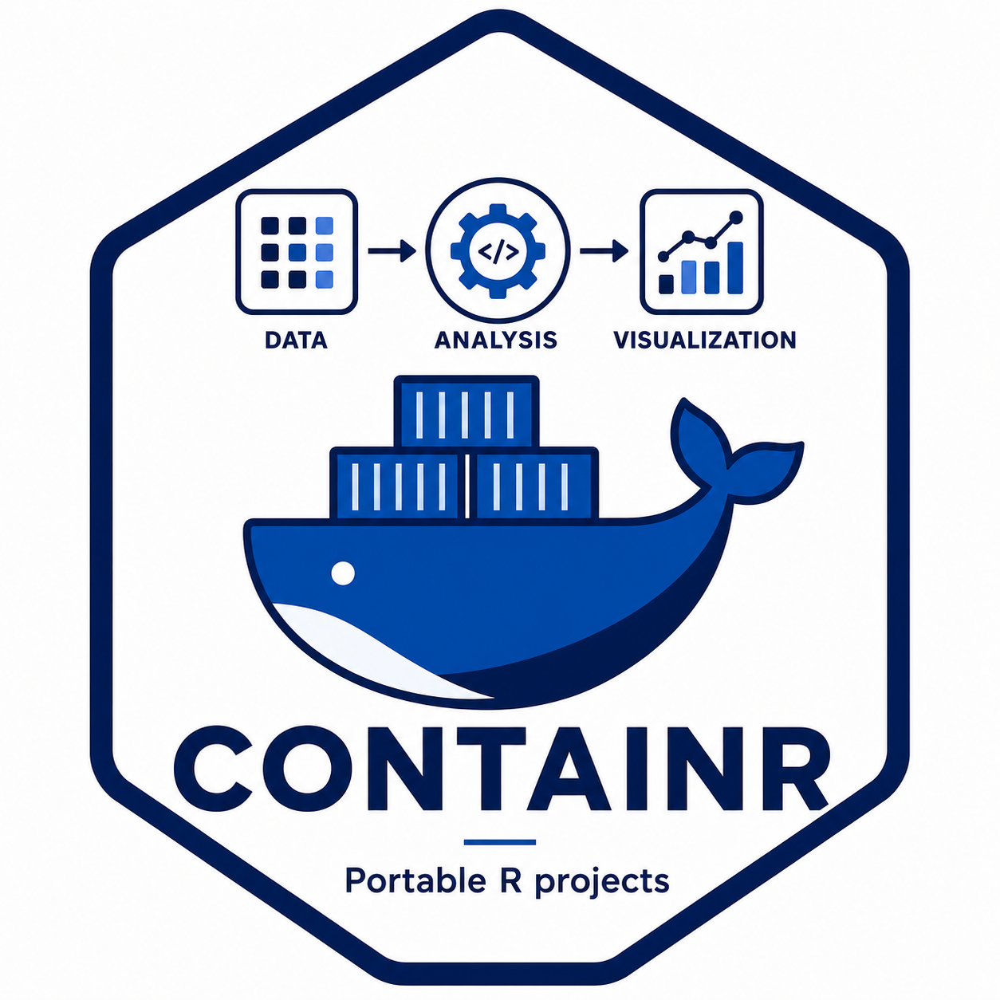

# A first containerization workflow with containr



## Before you start

This vignette walks through the complete `containr` workflow: generating
a `Dockerfile`, building a container image, inspecting local images, and
pushing the image to a registry. It assumes you are comfortable with R
and have some familiarity with the idea of containers. If you are new to
containers and want to understand why they complement `renv` rather than
replace it, start with the companion vignette *From renv to containers:
why recording your R packages may not be enough*.

Before running any of the code below, confirm that:

- your project uses `renv` and `renv.lock` exists in the project root;
- Podman or Docker is installed and running;
- you have access to a container registry if you plan to push the image.

At UW-Madison, `registry.doit.wisc.edu` is the default registry for the
CHTC-oriented workflow. The authentication guide, including how to
create a Personal Access Token with the right scopes, is at
<https://git.doit.wisc.edu/ERWIN.LARES/container-registry>.

If you are working through this vignette for the first time,
`dry_run = TRUE` is available on
[`build_image()`](https://erwinlares.github.io/containr/reference/build_image.md)
and
[`push_image()`](https://erwinlares.github.io/containr/reference/push_image.md).
It prints the command that would be run without executing it. Use it
freely until you are confident in each step.

------------------------------------------------------------------------

## Step 1: Generate a Dockerfile

[`generate_dockerfile()`](https://erwinlares.github.io/containr/reference/generate_dockerfile.md)
reads your `renv.lock`, infers the system library requirements of your R
packages, and writes a `Dockerfile` in the project root. It is the entry
point into the `containr` workflow and the step that does the most work
on your behalf.

``` r

generate_dockerfile(
  r_version = "4.4.0",
  output    = ".",
  comments  = TRUE
)
```

The `r_version` argument should match the R version recorded in your
`renv.lock`. Using a consistent R version between your lockfile and your
base image reduces the chance of package installation failures inside
the container.

The `comments = TRUE` argument annotates each instruction in the
generated `Dockerfile` with an explanation of what it does. This is
useful when you are learning containerization or reviewing the file with
collaborators. Here is what the generated `Dockerfile` looks like with
comments enabled:

``` dockerfile
# Base image: rocker/r-ver provides a minimal R installation on Ubuntu.
# Pinning the R version ensures the container matches your renv.lock.
FROM rocker/r-ver:4.4.0

# Suppress interactive prompts during apt-get package installation.
ENV DEBIAN_FRONTEND=noninteractive

# Install system libraries required by your R packages.
# These are inferred from the packages recorded in renv.lock.
RUN apt-get update && apt-get install -y \
    curl \
    git \
    libcurl4-openssl-dev \
    libssl-dev \
    libxml2-dev \
    libgit2-dev \
    cmake \
    make \
    libfreetype6-dev \
    libjpeg-dev \
    libpng-dev \
    libtiff-dev \
    libfontconfig1-dev \
    libfribidi-dev \
    libharfbuzz-dev \
    pandoc \
    && apt-get clean \
    && rm -rf /var/lib/apt/lists/*

# Set the working directory inside the container.
WORKDIR /home

# Copy renv.lock into the container so renv can restore the R package
# environment at build time.
COPY renv.lock /home/renv.lock

# Install renv from CRAN, then restore the R package environment from
# renv.lock. This step reproduces your exact package versions inside
# the container.
RUN R -e "install.packages('renv', repos='https://packagemanager.posit.co/cran/latest')"
RUN R -e "renv::restore()"
```

The `Dockerfile` is a plain text file. You can inspect it, edit it, and
regenerate it as many times as needed. If your project has unusual
system library requirements that
[`generate_dockerfile()`](https://erwinlares.github.io/containr/reference/generate_dockerfile.md)
did not catch, add them to the `install_syslibs` argument:

``` r

generate_dockerfile(
  r_version       = "4.4.0",
  output          = ".",
  install_syslibs = c("libuv1-dev", "libwebp-dev")
)
```

If your analysis depends on data files, scripts, or other assets that
should be available inside the container, pass them via `data_file`,
`code_file`, and `misc_file`. The generated `COPY` instructions preserve
your local directory structure under `/home/` – a file at
`data-raw/sample.csv` locally becomes `/home/data-raw/sample.csv` in the
container. All files must be inside the current working directory (the
build context). Each argument accepts a single path, a character vector
of paths, or a path to a directory – a directory is copied whole rather
than one file at a time, and files and directories can be mixed freely
within the same vector.

``` r

generate_dockerfile(
  r_version = "4.4.0",
  data_file = "data-raw/sample.csv",
  code_file = c("analysis.R", "helpers.R"),
  misc_file = "assets/",
  output    = ".",
  comments  = TRUE
)
```

If your project uses RStudio Server rather than plain R, pass
`r_mode = "rstudio"` to use the `rocker/rstudio` base image instead:

``` r

generate_dockerfile(
  r_version = "4.4.0",
  r_mode    = "rstudio",
  output    = "."
)
```

If your project renders `.qmd` files, pass `install_quarto = TRUE` to
install the Quarto CLI inside the container. Every other layer in the
image is pinned deliberately – `r_version` locks R and system libraries,
`renv.lock` locks R package versions – and `quarto_version` extends that
same guarantee to Quarto. Left at the default `"latest"`, the actual
release is resolved once at generation time and installed from a
versioned URL, so rebuilding the same `Dockerfile` later reproduces the
same Quarto version rather than whatever happens to be current at build
time. Pass an explicit version (e.g. `"1.5.57"`) to pin to a specific
release instead; it’s validated against Quarto’s own releases and errors
if no matching release exists. Either way, the resolved version is
recorded in the `Dockerfile` as `ENV QUARTO_VERSION=...`, so it’s
recoverable from a running container without the original `Dockerfile`
on hand.

``` r

generate_dockerfile(
  r_version      = "4.4.0",
  install_quarto = TRUE,
  quarto_version = "1.5.57",
  output         = "."
)
```

Take a few minutes to read the generated `Dockerfile` before moving on.
Understanding what it does makes the subsequent steps easier to reason
about and debug if something goes wrong.

------------------------------------------------------------------------

## Step 2: Build the image

[`build_image()`](https://erwinlares.github.io/containr/reference/build_image.md)
passes your `Dockerfile` to Podman or Docker and builds the image
locally. The first build pulls the base image and installs every R
package in your `renv.lock` from scratch, so it can take several minutes
depending on the size of your package library and your network
connection.

``` r

build_image(verbose = TRUE)
```

The `platform` argument defaults to `"linux/amd64"`, which is the
architecture used by CHTC and most HPC clusters. On Apple Silicon Macs,
this means the image targets a different architecture than the host.
When Docker is the resolved tool,
[`build_image()`](https://erwinlares.github.io/containr/reference/build_image.md)
automatically uses `docker buildx build` with `--load` for
cross-platform builds. For Podman, `--platform` is passed directly. If
the target platform differs from the host, a warning is emitted about
potential emulation issues.

Docker Desktop handles cross-platform builds more reliably than Podman’s
QEMU emulation layer. If builds fail with segfaults under Podman, try
`tool = "docker"` or build on a native x86_64 machine.

``` r

# Build for the host architecture (e.g. local use on Apple Silicon)
build_image(platform = NULL, verbose = TRUE)

# Build for ARM64 explicitly
build_image(platform = "linux/arm64", verbose = TRUE)
```

With `verbose = TRUE`, the build output streams to the console so you
can watch the installation progress. The output looks something like
this:

``` bash

i Resolving tool: using "docker"
i Target platform: "linux/amd64"
i Building image (no tag applied)
i Build context: /home/user/my-analysis, Dockerfile: Dockerfile
STEP 1/7: FROM rocker/r-ver:4.4.0
STEP 2/7: ENV DEBIAN_FRONTEND=noninteractive
STEP 3/7: RUN apt-get update && apt-get install -y ...
...
STEP 6/7: RUN R -e "install.packages('renv', ...)"
STEP 7/7: RUN R -e "renv::restore()"
v Image built successfully.
```

If you want to preview the build command without running it:

``` r

build_image(dry_run = TRUE)
#> docker buildx build --platform linux/amd64 --load -f Dockerfile .
```

Subsequent builds are usually faster because Podman and Docker cache
layers. If only your `renv.lock` changed, the system library
installation step is reused from cache and only the R package
installation step reruns.

A common first-build failure is a missing system library. If
[`renv::restore()`](https://rstudio.github.io/renv/reference/restore.html)
fails inside the container with a message about a missing header file or
a failed compilation, add the relevant library to `install_syslibs` in
[`generate_dockerfile()`](https://erwinlares.github.io/containr/reference/generate_dockerfile.md),
regenerate the `Dockerfile`, and rebuild.

## Step 3: Inspect local images

[`list_images()`](https://erwinlares.github.io/containr/reference/list_images.md)
returns a data frame of images in the local image store. It is the R
equivalent of `podman image ls` or `docker image ls`.

``` r

imgs <- list_images()
imgs
```

                                        repository   tag      image_id    created    size
    1  registry.doit.wisc.edu/your.netid/my-analysis  1.0.0  974123909a36  2 hours ago  1.59 GB
    2                                         <none>  <none>  3b8f20dc1a47  3 hours ago  1.21 GB

The `image_id` column contains the hash you pass to
[`push_image()`](https://erwinlares.github.io/containr/reference/push_image.md).
Untagged images — those built without a name — appear with `<none>` in
the `repository` and `tag` columns. These accumulate during development
as you rebuild with different settings and can be pruned periodically.

Use `imgs$image_id[1]` to pass the most recently built image to the next
step, or select a specific row if you have multiple images and want to
push a particular one.

------------------------------------------------------------------------

## Step 4: Push the image to the registry

[`push_image()`](https://erwinlares.github.io/containr/reference/push_image.md)
tags a local image with a registry path and pushes it to a container
registry. Before pushing, authenticate with the registry once in a
terminal. `containr` checks whether you are logged in before attempting
the push and errors with clear instructions if not.

``` r

push_image(
  image_id  = imgs$image_id[1],
  namespace = "your.netid",
  project   = "my-analysis",
  tag       = "1.0.0"
)
```

The push output looks something like this:

    ℹ Tagging image 974123909a36 as
      registry.doit.wisc.edu/your.netid/my-analysis:1.0.0
    ℹ Pushing to registry.doit.wisc.edu/your.netid/my-analysis:1.0.0
    ...
    ✔ Image pushed successfully.
    ℹ Image URI: docker://registry.doit.wisc.edu/your.netid/my-analysis:1.0.0

To preview the tag and push commands without running them:

``` r

push_image(
  image_id  = imgs$image_id[1],
  namespace = "your.netid",
  project   = "my-analysis",
  tag       = "1.0.0",
  dry_run   = TRUE
)
#> podman tag 974123909a36 registry.doit.wisc.edu/your.netid/my-analysis:1.0.0
#> podman push registry.doit.wisc.edu/your.netid/my-analysis:1.0.0
```

A note on tagging: use explicit version tags like `"1.0.0"` rather than
`"latest"`. The `"latest"` tag is overwritten on every push, which makes
it difficult to reconstruct which image was used for a specific result.
An explicit version tag ties the image to a specific state of the
analysis and can be referenced unambiguously in submit files,
documentation, and data management plans.

------------------------------------------------------------------------

## Putting it together

The complete workflow from a project with a `renv.lock` to a pushed
container image takes four function calls:

``` r

library(containr)

# 1. Generate the Dockerfile
generate_dockerfile(
  r_version = "4.4.0",
  output    = ".",
  comments  = TRUE
)

# 2. Build the image
build_image(verbose = TRUE)

# 3. Inspect local images
imgs <- list_images()

# 4. Push to the registry
push_image(
  image_id  = imgs$image_id[1],
  namespace = "your.netid",
  project   = "my-analysis",
  tag       = "1.0.0"
)
```

The image URI returned by
[`push_image()`](https://erwinlares.github.io/containr/reference/push_image.md)
is the reference you pass to any downstream workflow that needs to run
the containerized analysis. For HTCondor submissions, it goes in the
submit file:

    container_image = docker://registry.doit.wisc.edu/your.netid/my-analysis:1.0.0

The `submitr` package handles the next step: generating the submit file,
uploading files to the submit node, dispatching the job, and retrieving
results. You can stop here if your goal is a portable, shareable R
environment, and return to `submitr` when the project is ready to run on
CHTC.

------------------------------------------------------------------------

## Troubleshooting

**The build fails with a missing system library.** Add the library to
`install_syslibs` in
[`generate_dockerfile()`](https://erwinlares.github.io/containr/reference/generate_dockerfile.md),
regenerate, and rebuild. The error message from the failed compilation
usually names the missing library or header file directly.

**[`renv::restore()`](https://rstudio.github.io/renv/reference/restore.html)
fails inside the container.** Check whether the package requires a
system library that
[`generate_dockerfile()`](https://erwinlares.github.io/containr/reference/generate_dockerfile.md)
did not infer automatically. Packages with compiled C or C++ code are
the most common source of this problem.

**[`push_image()`](https://erwinlares.github.io/containr/reference/push_image.md)
errors with an authentication message.** Run
`podman login registry.doit.wisc.edu` in a terminal and authenticate
before retrying. The authentication guide is at
<https://git.doit.wisc.edu/ERWIN.LARES/container-registry>.

**The image is very large.** The size is driven primarily by the number
of R packages in your `renv.lock` and their system library dependencies.
This is expected. A project with many packages will produce a large
image. Size can be reduced by trimming unused packages from the lockfile
before building.

**The build fails with a QEMU segfault on Apple Silicon.** Building
`linux/amd64` images on ARM hosts requires emulation, which can crash
during R package installation. Switch to Docker Desktop
(`tool = "docker"`), which uses `buildx` and handles cross-platform
builds more reliably. Alternatively, build on a native x86_64 machine or
via GitHub Actions.
